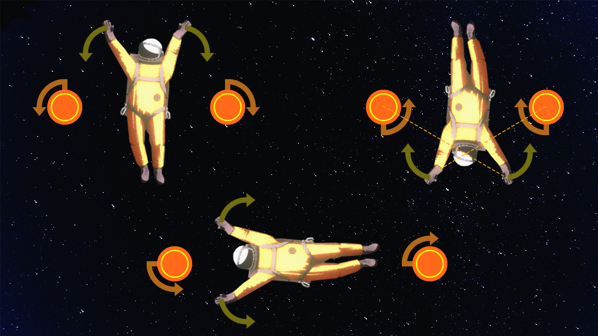

# Movement

## Tips

### Swimming

By moving your arms back and forth you will swim through the air. This is used to move quickly. This cannot be done in Newtonian.

## Movement types

### Classic

- Allows you to rotate be moving your arms in the direction you want
- Allows you to swim through space

### Newtonian

- Hardest movement type
- Requires grabbing onto the world to maintain control
- Cannot rotate by moving arms
- Cannot swim through space

### Assisted

- Has all Classic features
- Pointing arms up relative to your orientation will automatically kick your legs
